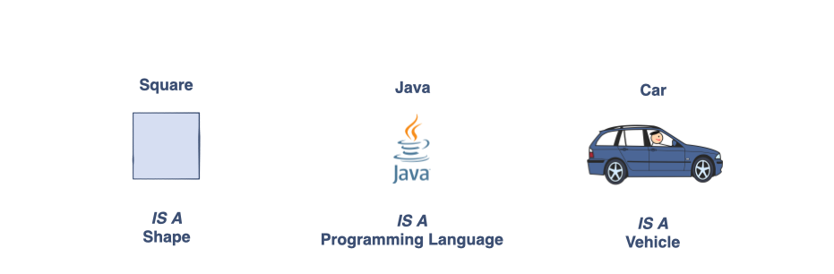
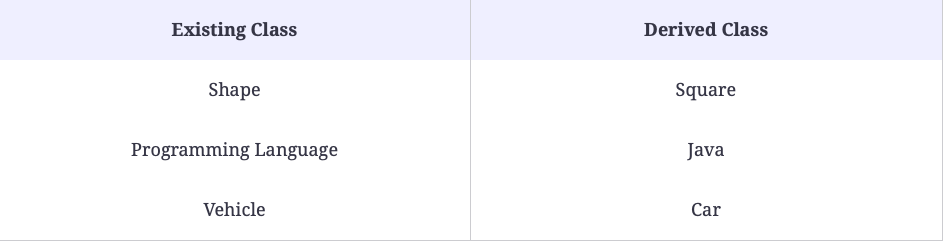
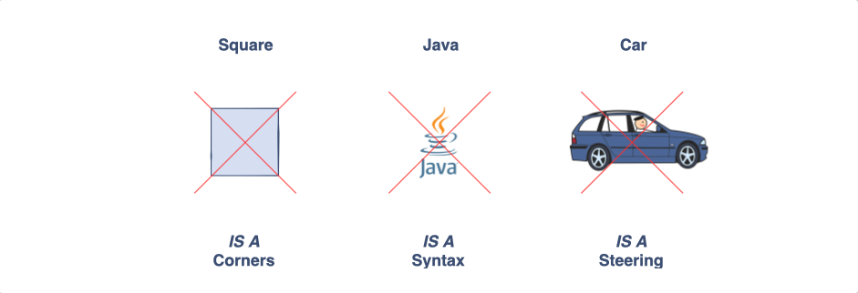

# What is Inheritance?

Intention: In this chapter, you will be introduced to Inheritance, a powerful concept of Object-Oriented Programming.

Now that you have got familiar with the concepts of <i>objects</i> and <i>classes</i>, let’s discuss <b>inheritance</b> 
which is another key concept in the <i>Object-Oriented Programming</i>.

## Definition

<b>Inheritance</b> provides a way to create a new class from an existing class. The new class is a specialized version of 
the existing class such that it inherits all the <i>non-private</i> fields (<i>variables</i>) and <i>methods</i> of 
the existing class. The existing class is used as a starting point or as a <i>base</i> to create the new class.

## The <i>IS A</i> Relationship

After reading the above definition, the next question that comes to your mind is <i>What is the use case of inheritance?</i> 
Well, the answer is that wherever we come across an <b><i>IS A</i></b> relationship between objects, we can use inheritance.

In the above illustration, we can see there are three objects having an <b><i>IS A</i></b> relationship between them. 
We can write it as:

- A square <b><i>IS A</i></b> shape;
- Java <b><i>IS A</i></b> programming language;
- Car <b><i>IS A</i></b> vehicle.

So from the above descriptions regarding <i>inheritance</i>, we can conclude that we can build new classes by depending 
on the <i>existing classes</i>. We can build some new <i>classes</i>.

Let’s find out where an <b><i>IS A</i></b> relationship doesn’t exist.

In the above illustration, it’s obvious that we cannot use <i>inheritance</i> as an <b><i>IS A</i></b> relationship doesn’t 
exist between the objects.

## The Java Object class

The basic purpose of object-oriented programming is to enable a programmer to model the <i>real world objects</i> using a 
programming language. In Java whenever we create a `class`, it inherits all the `non-private` <i>methods</i> and 
<i>fields</i> from the builtin Java `Object` by default which makes it a very good example of inheritance in Java. 
The methods defined in the `Object` class come in very handy when you create <i>new classes</i>. 

Next: [The Syntax and Terminologies](chapter_12.md "The Syntax and Terminologies") - The Syntax and Terminologies.

Previous: [Understanding Encapsulation Using Examples](chapter_10.md "Understanding Encapsulation Using Examples") - 
Understanding Encapsulation Using Examples.