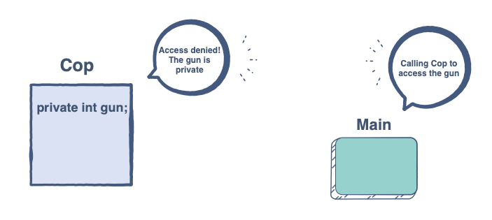
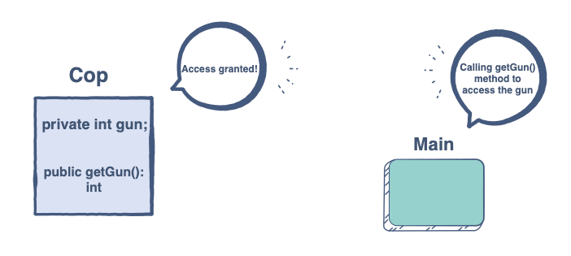

# Access Modifiers

Intention: You will learn about the private, public and protected data members.

In Java, we can impose access restrictions on different data members and member functions. 
The restrictions are specified through <b>access modifiers</b>. Access modifiers are tags we can associate with 
each member to define which parts of the program can access it directly.

There are three types of access modifiers. Let’s take a look at them one by one.

## Private

A private member cannot be accessed directly from outside the class. The aim is to keep it hidden from the users 
and other classes. It is a popular practice to <b>keep the data members private</b> since we do not want anyone 
manipulating our data directly. We can make members private using the keyword `private`.



```java
package com.github.akarazhev.jacademy.jprog.oop.justice;

public final class Cop {

    private int gun; // We have explicitly defined that the variable is private
    // ...
}
```

## Public

This tag indicates that the members can be directly accessed by anything which is in the same scope as the class object.

<b>Member functions are usually public</b> as they provide the interface through which the application can communicate 
with our private members.

Public members can be declared using the keyword `public`.



```java
package com.github.akarazhev.jacademy.jprog.oop.justice;

public final class Cop {
    private int gun; // Private variable

    public int getGun() {
        return gun;  // The private variable is directly accessible over here!
    }
}
```

Public members of a class can be accessed by a class object using the `.` operator. For example, if we have an object `c` 
of type `Cop`, we could access `getGun()` like this:

```java
final Cop c = new Cop(); // Object created
c.getGun(); // Can access the gun
c.gun = 0; // This would cause an error since gun is private
```

## Protected

The protected category is unique. The access level to the protected members lies somewhere between private and public. 
The primary use of the protected tag can be found when using <b>inheritance</b>, which is the process of creating classes 
out of other classes.

The protected data members can be accessed inside a Java package. However, outside the package, they can only be 
referred to through an inherited class.

```java
package com.github.akarazhev.jacademy.jprog.oop.justice;

public final class Cop {
    private int gun;

    public int getGun() {
        return gun;
    }

    protected void fire() {
        System.out.println("shoot!");
    }
}
```

```java
package com.github.akarazhev.jacademy.jprog.oop.crime;

import com.github.akarazhev.jacademy.jprog.oop.justice.Cop;

public final class Thief {

    public static void main(final String[] args) {
        final Cop obj = new Cop();
        obj.fire(); // Compile Time Error
    }
}
```

The `Thief` class will throw a compile-time error because it is trying to access the `fire()` method of the `Cop` class 
which is defined in a different package.

The inheritance will be covered later.

## Default

If we do not mention any access modifier, then it is considered to be default access. The default access is similar to 
the `protected`. It also has package-level access, but it also applies to inherited classes as well, unlike `protected`. 
So, you can say that its access is more limited.

We’ve seen a hint of how data members can be created in a class. In the next chapter, we will go into further details 
on the topic.

<hr>

Next: [Fields](chapter_4.md "Fields") - Fields.

Previous: [Declaration and Implementation](chapter_2.md "Declaration and Implementation") - Declaration and Implementation.