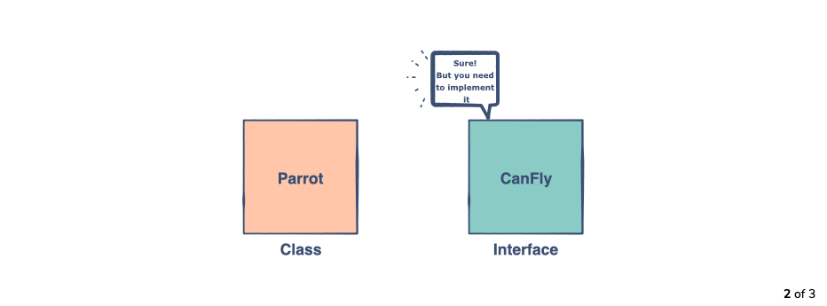
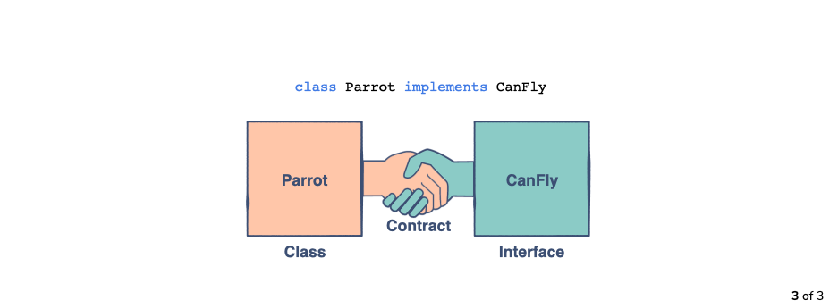

# Encapsulation

Intention: In this chapter, you'll get familiar with the component of data hiding i.e. Encapsulation.

## Definition

Encapsulation is a fundamental programming technique in OOP used to achieve data hiding.

> <b>Encapsulation</b> in OOP refers to binding the <b>data</b> and the <b>methods to manipulate that data</b> 
> together in a single <b>unit</b> (class).

Depending upon this <b>unit</b>, objects are created. Encapsulation is normally done to hide the state and representation of 
an object from outside. A class can be thought of as a <b>capsule</b> having <i>methods</i> and <i>data members</i> inside it.

As a rule of thumb, a good convention is to declare all the <i>data members</i> or <i>instance variables</i> 
of a class `private`. This will restrict direct access from the code outside that class.

At this point, a question can be raised that if the methods and variables are encapsulated in a class then
<i>"how can they be used outside of that class"</i>?

Well, the answer to this is simple. One has to implement `public` methods to let the outside world communicate with 
this class. These methods can be <i>getters, setters</i> and any other custom methods implemented by the programmer.

## Advantages of Encapsulation#

- Classes are easier to change and maintain.
- We can specify which data member we want to keep hidden or accessible.
- We decide which variables have read/write privileges (increases flexibility).

In the next chapter, we’ll learn more about <b>Encapsulation</b> with the help of some examples.

Next: [Understanding Encapsulation Using Examples](chapter_10.md "Understanding Encapsulation Using Examples") - 
Understanding Encapsulation Using Examples.

Previous: [What is Data Hiding?](chapter_8.md "What is Data Hiding?") - What is Data Hiding?
