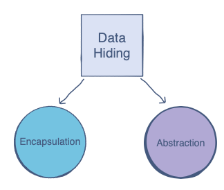

# What is Data Hiding?

Intention: In this chapter, you will get familiar with a very important aspect of Object Oriented Programming called 
data hiding.

## Introduction

In the [previous chapter](introduction.md "Introduction") you got familiar with the concept of objects and classes.

In <i>OOP</i>, objects and classes are the basic entities. Objects are created using classes. One can observe that classes 
contain data members and objects are created to manipulate and access this data. To make this object-oriented system 
more reliable and error free, it is a good practice to limit access to the class members.

> In layman’s terms, <i>data hiding</i> refers to the concept of <b>hiding the inner workings of a class</b> and simply 
> providing an <b>interface</b> through which the outside world can interact with the class without knowing what’s 
> going on inside.

The purpose is to implement classes in such a way that the instances (objects) of these classes should not be able 
to cause any unauthorized access or change in the original contents of a class. One class does not need to know anything 
about the underlying algorithms of another class. However, the two can still communicate.

## A Real Life Example

Let’s apply this to a real-world scenario. Take the doctor-patient model. In case of an illness, the patient consults 
the doctor, after which he or she is prescribed the appropriate medicine.

The patient only knows the process of going to the doctor. The logic and reasoning behind the doctor’s prescription of 
a certain medicine are unknown to the patient. A patient will not understand the medical details the doctor uses 
to reach his/her decision on the treatment.

This is a classic example of the patient class interacting with the doctor class without knowing the inner workings 
of the doctor class.

Data hiding is useful because it can apply the same simplicity to transactions between objects of different classes.

## Components of Data Hiding

Data hiding can be divided into two primary components:
1. Encapsulation
2. Abstraction

We will leave the abstraction part to a later chapter. In this section, will cover the encapsulation part in detail.

This was pretty much about <b>data hiding</b> and the related techniques. In the next chapter, you will learn about 
<b>Encapsulation</b>.

Next: [Encapsulation](encapsulation.md "Encapsulation") - Encapsulation.

Previous: [A Bit More about Constructors](constructors-more.md "A Bit More about Constructors") - A Bit More about Constructors.