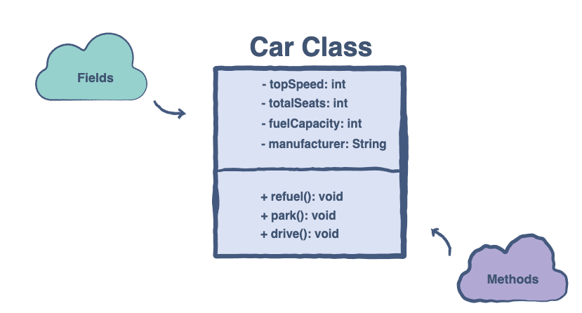

# Declaration and Implementation

Intention: You will learn about the declaration and implementation details of a class.

The written code of a class and its attributes are known as the <b>definition</b> or <b>implementation</b> of the class.

## Declaration

In Java, we define classes in the following way:

```java
package com.github.akarazhev.jacademy.jprog.oop.declimpl;

public final class ClassName { // Class name
  /* All member variables
  and methods*/
}
```

The `class` command tells the compiler that we are creating our custom class. All the members of the class will be 
defined within the class scope.

## Creating a Class Object

The name of the class, `ClassName`, will be used to create an instance of the class in our main program. 
We can create an object of a class by using the keyword `new`:

```java
package com.github.akarazhev.jacademy.jprog.oop.declimpl;

public final class ClassName { // Class name
  /* All member variables
  and methods*/
    public static void main(final String[] args) {
        final ClassName obj = new ClassName(); // className object
    }
}
```

## Implementation of Car Class

Let’s implement the `Car` class illustrated below:



```java
package com.github.akarazhev.jacademy.jprog.oop.declimpl;

// The Structure of a Java Class
public final class Car { // Class name
    // Class Data members
    int topSpeed;
    int totalSeats;
    int fuelCapacity;
    String manufacturer;

    // Class Methods
    void refuel() {
    }

    void park() {
    }

    void drive() {
    }
}
```

We’ve seen the structure of a class and the basic skeleton of a `Car` class. In the next chapter, 
we build upon this by introducing the concept of access modifiers.

<hr>

Next: [Access Modifiers](modifiers.md "Access Modifiers") - Access Modifiers.

Previous: [Introduction](introduction.md "Introduction to Classes") - Introduction to Classes.