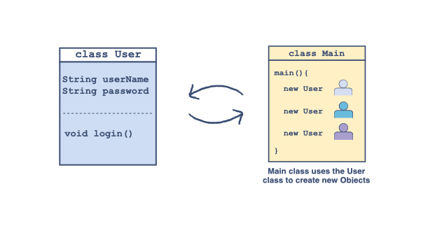
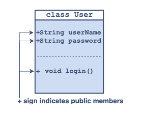
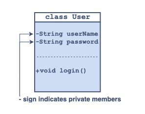

# Understanding Encapsulation Using Examples

Intention: In this chapter, you will get a firmer understanding of encapsulation in Java with the help of examples.

As discussed earlier, encapsulation refers to the concept of binding <b>data and the methods operating on that data</b> 
in a single unit also called a class.

The goal is to prevent this bound data from any unwanted access by the code outside this class. 
Let’s understand this using an example of a very basic `User` class.

Consider that we are up for designing an application and are working on modeling the <b>log in</b> part of that application. 
We know that a user needs a <b>username</b> and a <b>password</b> to log into the application.

A very basic `User` class will be modeled as:

- Having a field for the `userName`;
- Having a field for the `password`;
- A method named `login()` to grant access.

Whenever a new user comes, a new object can be created by passing the `userName` and `password` to the constructor of this class.



## A Bad Example

Now it is time to implement the above discussed `User` class.



The code according to the above illustration is given below:

```java
package com.github.akarazhev.jacademy.jprog.oop.encpln.bad;

// User Class
final class User {
    // Public Fields
    public String userName;
    public String password;

    // Parameterized Constructor to create new users
    public User(String userName, String password) {
        this.userName = userName;
        this.password = password;
    }

    public void login(String userName, String password) {
        // Check if the username and password match
        if (this.userName.toLowerCase().equals(userName.toLowerCase()) && this.password.equals(password)) {
            // .toLowrcase converts all the characters to lowercase & .equals checks if two strings match
            System.out.println("Access Granted against the username: " + this.userName + " and password: " + this.password);
        } else {
            System.out.println("Invalid Credentials!"); // Else invalid credentials
        }
    }
}

public final class Main {

    public static void main(final String[] args) {
        User educative = new User("Educative", "12345"); //Creates a new user and stores the password and username
        educative.login("Educative", "12345"); //Grants access because credentials are valid
        educative.login("Educative", "3456"); //Does not grant access because the credentials are invalid
        educative.password = "3456"; //OOPS SOMEONE ACCESSED THE PASSWORD FIELD
        educative.login("Educative", "3456"); // GRANTS ACCESS BUT THIS SHOULD NOT HAVE HAPPENED!
    }
}
```

In the above coding example, we can observe that <b>anyone</b> can <i>access, change or print</i> the `password` and 
`userName` fields directly from the `main()` method. This is <b>dangerous</b> in the case of this `User` class because 
there is no encapsulation of the credentials of a user and anyone can access their account by manipulating the stored data. 
So the above code was not a good coding convention.

## A Good Example

Let’s move on to a good convention for implementing the `User` class!



```java
package com.github.akarazhev.jacademy.jprog.oop.encpln.good;

// User Class
final class User {
    // Private fields
    private final String userName;
    private final String password;

    // Parameterzied constructor to create a new users
    public User(String userName, String password) {
        this.userName = userName;
        this.password = password;
    }

    public void login(String userName, String password) {
        // Check if the username and password match
        if (this.userName.toLowerCase().equals(userName.toLowerCase()) && this.password.equals(password)) {
            // .toLowrcase converts all the characters to lowercase & .equals checks if two strings match
            System.out.println("Access Granted against the username: " + this.userName + " and password: " + this.password);
        } else {
            System.out.println("Invalid Credentials!"); //Else invalid credentials
        }
    }
}

public final class Main {

    public static void main(String[] args) {
        User educative = new User("Educative", "12345"); // Creates a new user and stores the password and username
        educative.login("Educative", "12345"); // Grants access because credentials are valid
        educative.login("Educative", "3456"); // Does not grant access because the credentials are invalid
        // educative.password = "3456"; //Uncommenting this line will give an error
        // Fields of User class cannot be accessed now
    }
}
```

In the above example, the fields of `userName` and `password` are declared `private`.

As a rule of thumb, in a class, all the member variables should be declared `private` and to access and operate on 
that data `public` methods like <i>getters, setters and custom methods</i> should be implemented.

This is the concept of encapsulation. All the field containing data are private and the methods which provide 
an interface to access those fields are public.

<hr>

Next: [What is Inheritance?](inheritance.md "What is Inheritance?") - What is Inheritance?

Previous: [Encapsulation](encapsulation.md "Encapsulation") - Encapsulation.   
