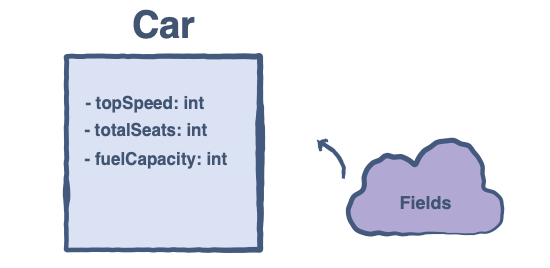
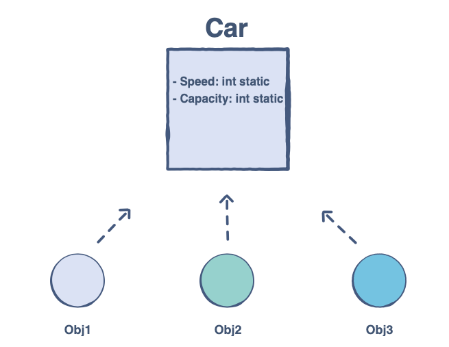
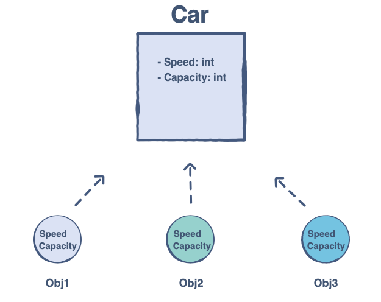

# Fields

Intention: You will go into the details of the fields of a class.

## Java Fields

Java fields are actually the <i>data members</i> inside a class. For instance, in a class representing Car, the Car class 
might contain the following fields:
- <i>topSpeed</i>;
- <i>totalSeats</i>;
- <i>fuelCapacity</i>.



The Java class could be defined like this:

```java
package com.github.akarazhev.jacademy.jprog.oop.fields;

public final class Car {
    int topSpeed;
    int totalSeats;
    int fuelCapacity;
}
```

## Static and Non-static Fields

Java supports static and non-static fields.

### Static Field

A static field resides in a class. All the objects we create will share this field and its value.



You can define a `static` field by using the static keyword in Java:

```java
package com.github.akarazhev.jacademy.jprog.oop.fields;

public final class Car {
    // static fields
    static int speed;
    static int capacity;
}
```

Static fields reside in the class. We don’t need an instance of the class to access static fields. 
We can access the static fields of a class by just writing the class name before the field:

```java
// Static fields are accessible in the main
System.out.println(Car.speed);
System.out.println(Car.capacity);
```

### Non-Static Field

Non-static fields are located in the instances of the class. Each instance of the class can have its own values for 
these fields.



You can define a non-static field like this in Java:

```java
package com.github.akarazhev.jacademy.jprog.oop.fields;

public final class Car {
    // Non-Static Fields
    int speed;
    int capacity;
}
```

As non-static fields doesn’t reside in the class, So we need an instance of the class to access non-static fields.

```java
final Car obj1 = new Car();

System.out.println(obj1.speed);
System.out.println(obj1.capacity);
```

### Final Fields

A final field cannot have its value changed once it is assigned. We can make a field final by using the keyword `final`.

Here is an example in Java:

```java
package com.github.akarazhev.jacademy.jprog.oop.fields;

public final class Car {
    // Final field of capacity = 4
    // Now Capacity can never be changed from 4
    // to some other value throughout the program
    final int capacity = 4;
}
```

`Car` class has the capacity equals to 4 which can’t be changed. If you try to do so, you will get a compilation error:

`can't assign a value to final variable capacity`.

You can check it on your own in the following code widget:

```java
package com.github.akarazhev.jacademy.jprog.oop.fields;

public class Demo {

    public static void main() {
        final Car car = new Car();
        car.capacity = 5; // Trying to change the capacity value
    }
}
```

In the chapter lesson, we’ll discuss methods in Java.

<hr>

Next: [Methods](methods.md "Methods") - Methods.

Previous: [Access Modifiers](modifiers.md "Access Modifiers") - Access Modifiers.