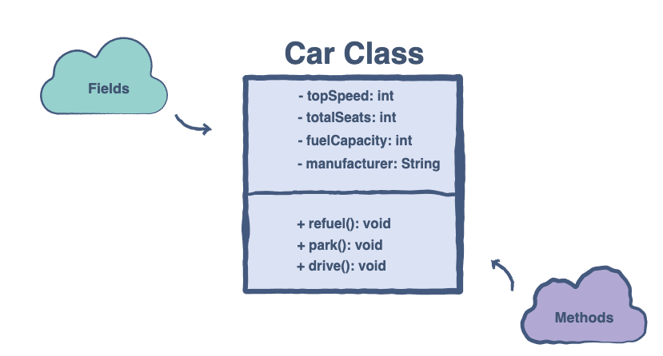

# Introduction to Classes

Intention: Getting familiar with the basic building blocks of Object-Oriented Programming: Classes.

## A Brief Encounter

In the real world, we can find many objects around us like cars, buildings, and humans. All these objects have 
some state and behavior. If we consider a car, then its states are <b>name</b>, <b>speed</b>, and <b>fuel</b>, and 
the behavior is <b>refuel</b>, <b>drive</b>, and <b>park</b>.

## Definition

> <b>Classes</b> are the building blocks of programs built using the object-oriented methodology. 
> Such programs consist of <i>independent self-managing modules and their interactions</i>.

In Java, we have several different data types like `int`, `char`, `boolean` etc.

> An <b>object</b> is an instance of a module, and a class is its definition.

We can use any of the above-mentioned types in the program, but they provide very limited features to the developers. 
Well, object-oriented programming wouldn’t make sense if we couldn’t make our own objects. 
This is where <b>classes</b> come into play.

Classes are used to create <i>user-defined data types</i>. The predefined data types in Java are classes themselves. 
We can use these basic data types to create our own class. The cool part is that our class can contain multiple variables, 
pointers, and functions which would be available to us whenever a class object is created.

Let’s start with an example of a `Car` class. Below, we can see the <b>state</b> of a car object represented as variables:

We can see two types of attributes in the `Car` class above. In general, these two categories are present in all classes.

## Fields

These are also known as the <b>member variables</b> of a class. This is because they contain the information relevant 
to the object of the class. A car object would have a top speed, a certain number of seats, and so many other pieces of 
data that we could store in variables.

## Methods

This category of attributes enables the class object to perform operations using the fields. In the case of the car class, 
the `refuel()` function would fill up the `fuelCapacity` property of the object.

## Benefits of Using Classes

The concept of classes allows us to create complex objects and applications in Java. 
This is why classes are the basic building blocks behind all of the OOP’s principles.

Classes are also very useful in compartmentalizing the code of an application. Different components could become 
separate classes which would interact through interfaces. These ready-made components will also be available for use 
in future applications.

The use of classes makes it easier to maintain the different parts of an application since it is easier to make changes 
in classes (more on this later).