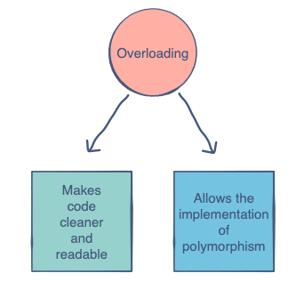

# Methods

Intention: You will get to know about the role of methods in classes.

## The Purpose of Methods

Methods act as an interface between a program and the data fields of a class in the program.

These methods can either alter the content of the data fields or use their values to perform a certain computation. 
All the useful methods should be <b>public</b>, although, some methods which do not need to be accessed from the outside 
could be kept private.

## Definition and Declaration

> A method is a group of statements that performs some operations and may or may not return a result.

Here is an example of a method in Java:

```java
package com.github.akarazhev.jacademy.jprog.oop.methods;

final class Car {
    // Public method to print speed
    public void printSpeed(final int speed) {
        System.out.println("Speed: " + speed);
    }
}

public final class Demo {

    public static void main(final String[] args) {
        final Car car = new Car();
        car.printSpeed(100); // calling public method
    }
}
```

## Method Parameters, Return Type

<b>Method parameters</b> make it possible to pass values to the method and <b>return type</b> makes it possible 
to get the value from the method. The parameters are declared inside the parentheses after the method name while 
the `return` type is declared before method name.

## Return Statement

For methods that define a return type, the <b>return statement</b> must be immediately followed by return value.

```java
// public method with one parameter speed.
public int printSpeed(final int speed) {
  // ...
  return speed + 5; // return statement
}
```

This method adds 5 to the parameter `speed` passed to it and returns the result.

The return type, `int`, which comes before the method name <b>PrintSpeed</b>, indicates that this method returns an `int`.

## Getters and Setters

These two types of methods are very popular in OOP. A <b>get</b> method retrieves the value of a particular data field, 
whereas a <b>set</b> method sets its value.

It is a common convention to write the name of the corresponding member fields with the `get` or `set` command.

Let’s write get and set methods for the ‘speed’ in our `Car` class:

```java
package com.github.akarazhev.jacademy.jprog.oop.methods;

final class Car {
    private int speed; // member field speed

    // Setter method to set the speed of the car
    public void setSpeed(final int x) {
        speed = x;
    }

    // Getter method to get the speed of the car
    public int getSpeed() {
        return speed;
    }

    // Public method to print speed
    public void printSpeed(final int speed) {
        System.out.println("Speed: " + speed);
    }
}

public final class Demo {

    public static void main(final String[] args) {
        final Car car = new Car();
        car.printSpeed(100); // calling public method
        car.setSpeed(100); // calling the setter method
        System.out.println(car.getSpeed()); // calling the getter method
    }
}
```

## Method Overloading

> Overloading refers to making a method perform different operations based on the nature of its arguments.

Methods can be overloaded in Java.

We could redefine a method several times and give it different arguments and method types. When the method is called, 
the appropriate definition will be selected by the compiler!

Let’s see this in action by overloading the `product` method in the Calculator class:

```java
package com.github.akarazhev.jacademy.jprog.oop.methods.calc;

class Calculator {

    public double product(double x, double y) {
        return x * y;
    }

    // Overloading the function to handle three arguments
    public double product(double x, double y, double z) {
        return x * y * z;
    }

    // Overloading the function to handle int
    public int product(int x, int y) {
        return x * y;
    }
}

public final class Demo {

    public static void main(final String[] args) {
        final Calculator cal = new Calculator();

        double x = 10;
        double y = 20;
        double z = 5;

        int a = 12;
        int b = 4;

        System.out.println(cal.product(x, y));
        System.out.println(cal.product(x, y, z));
        System.out.println(cal.product(a, b));
    }
}
```

In the code above, we see the same method behaving differently when encountering different types of inputs.

> Note: Methods which have no arguments and differ only in the return types cannot be overloaded since the compiler 
> won’t be able to differentiate between their calls.

## Advantages of Method Overloading

One might wonder that we could simply create new methods to perform different jobs rather than overloading the same 
method. However, an obvious benefit is that the code becomes simple and clean. We don’t have to keep track of different 
methods.

Polymorphism is a very important concept in object-oriented programming. It will come up later on in the project, 
but method overloading plays a vital role in its implementation.



At this point, we know all about the attributes of a class. However, the most crucial part is still left to explore. 
How do we define what happens when an object of our class is created? We’ll find out in the next chapter.

<hr>

Next: [Constructors](constructors.md "Constructors") - Constructors.

Previous: [Fields](fields.md "Fields") - Fields.