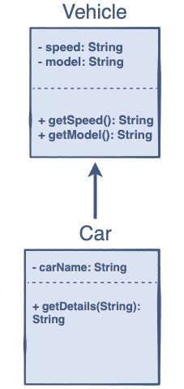

# Java Programming: oop

## Challenge: Implement the Derived Class

Can you Implement the Derived Class function by using the Base Class functions?

### Problem Statement

Implement a function `getDetails(String carName)` of the <b>Derived Class</b> `Car` which takes a string `carName` and 
appends it with model, name, and speed. We have already implemented the <b>Base Class</b> `Vehicle` with 
the member functions `getModel()` and `getSpeed()` which return the model and speed of the car respectively.

### Input

Car Name

### Output

Car Name, Model, Speed

### Sample Input

`
"Roadster";
`

### Sample Output

`
"Roadster, Tesla, 100";
`

## Task steps

1. Put your program here: `com.github.akarazhev.jacademy.practice.jprog.task10` in the `Car` class;
2. Write a meaningful message with a commit and push the code;
3. Show the result to a mentor;
4. Answer some questions.

## Questions

1. What is the `Inheritance`?
2. Propose a couple of examples. 

## Answers

Answer questions to a mentor in English.

## Theory chapters

1. [Introduction](../../../java-programming/doc/oop/chapter_1.md "Introduction to Classes") - Introduction to Classes;
2. [Declaration and Implementation](../../../java-programming/doc/oop/chapter_2.md "Declaration and Implementation") - 
   Declaration and Implementation;
3. [Access Modifiers](../../../java-programming/doc/oop/chapter_3.md "Access Modifiers") - Access Modifiers;
4. [Fields](../../../java-programming/doc/oop/chapter_4.md "Fields") - Fields;
5. [Methods](../../../java-programming/doc/oop/chapter_5.md "Methods") - Methods;
6. [Constructors](../../../java-programming/doc/oop/chapter_6.md "Constructors") - Constructors;
7. [A Bit More about Constructors](../../../java-programming/doc/oop/chapter_7.md "A Bit More about Constructors") -
   A Bit More about Constructors;
8. [What is Data Hiding?](../../../java-programming/doc/oop/chapter_8.md "What is Data Hiding?") - What is Data Hiding?
9. [Encapsulation](../../../java-programming/doc/oop/chapter_9.md "Encapsulation") - Encapsulation;
10. [Understanding Encapsulation Using Examples](../../../java-programming/doc/oop/chapter_10.md "Understanding Encapsulation Using Examples") -
    Understanding Encapsulation Using Examples;
11. [What is Inheritance?](../../../java-programming/doc/oop/chapter_11.md "What is Inheritance?") - What is Inheritance?
12. [The Syntax and Terminologies](../../../java-programming/doc/oop/chapter_12.md "The Syntax and Terminologies") - 
    The Syntax and Terminologies;
13. [Super Keyword](../../../java-programming/doc/oop/chapter_13.md "Super Keyword") - Super Keyword;
14. [Types of Inheritance](../../../java-programming/doc/oop/chapter_14.md "Types of Inheritance") - Types of Inheritance;
15. [Advantages of Inheritance](../../../java-programming/doc/oop/chapter_15.md "Advantages of Inheritance") - 
    Advantages of Inheritance.