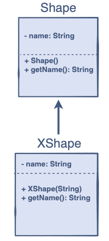

# Java Programming: oop

## Challenge: Override a Method using the Super Keyword

Can you Implement the Derived Class function by using the Base Class functions?

### Problem Statement

When a method in a derived class overrides a method in a base class, it is still possible to call the overridden 
method using the `super` keyword.

> If you write super.method(), it will call the method that was defined in the superclass.

You are given a partially completed code in the editor. The class `Shape` is the base class of the `XShape` class. 
You have to modify the `getName()` method of the derived class, i.e `XShape`, so that the code returns the following:

### Input

Derived Class Name

### Output

Base Class Name, Derived Class Name

### Sample Input

```java
Shape circle = new XShape("Circle");
```

### Sample Output

`
"Shape, Circle"
`



## Task steps

1. Put your program here: `com.github.akarazhev.jacademy.practice.jprog.task11` in the `Demo` class;
2. Write a meaningful message with a commit and push the code;
3. Show the result to a mentor;
4. Answer some questions.

## Questions

1. What is the `Polymorphism`?
2. Propose a couple of examples. 
3. What is the `Overloading`?
4. Propose a couple of examples.
5. What is the `Overriding`?
6. Propose a couple of examples.
7. What is the difference between the overloading and overriding of methods?
8. What is the difference between static and dynamic polymorphism?

## Answers

Answer questions to a mentor in English.

## Theory chapters

1. [Introduction](../../../java-programming/doc/oop/chapter_1.md "Introduction to Classes") - Introduction to Classes;
2. [Declaration and Implementation](../../../java-programming/doc/oop/chapter_2.md "Declaration and Implementation") - Declaration and Implementation;
3. [Access Modifiers](../../../java-programming/doc/oop/chapter_3.md "Access Modifiers") - Access Modifiers;
4. [Fields](../../../java-programming/doc/oop/chapter_4.md "Fields") - Fields;
5. [Methods](../../../java-programming/doc/oop/chapter_5.md "Methods") - Methods;
6. [Constructors](../../../java-programming/doc/oop/chapter_6.md "Constructors") - Constructors;
7. [A Bit More about Constructors](../../../java-programming/doc/oop/chapter_7.md "A Bit More about Constructors") -
   A Bit More about Constructors;
8. [What is Data Hiding?](../../../java-programming/doc/oop/chapter_8.md "What is Data Hiding?") - What is Data Hiding?
9. [Encapsulation](../../../java-programming/doc/oop/chapter_9.md "Encapsulation") - Encapsulation;
10. [Understanding Encapsulation Using Examples](../../../java-programming/doc/oop/chapter_10.md "Understanding Encapsulation Using Examples") -
    Understanding Encapsulation Using Examples;
11. [What is Inheritance?](../../../java-programming/doc/oop/chapter_11.md "What is Inheritance?") - What is Inheritance?
12. [The Syntax and Terminologies](../../../java-programming/doc/oop/chapter_12.md "The Syntax and Terminologies") - The Syntax and Terminologies;
13. [Super Keyword](../../../java-programming/doc/oop/chapter_13.md "Super Keyword") - Super Keyword;
14. [Types of Inheritance](../../../java-programming/doc/oop/chapter_14.md "Types of Inheritance") - Types of Inheritance;
15. [Advantages of Inheritance](../../../java-programming/doc/oop/chapter_15.md "Advantages of Inheritance") - Advantages of Inheritance;
16. [What is Polymorphism?](../../../java-programming/doc/oop/chapter_16.md "What is Polymorphism?") - What is Polymorphism?
17. [Polymorphism in OOP](../../../java-programming/doc/oop/chapter_17.md "Polymorphism in OOP") - Polymorphism in OOP;
18. [Method Overriding](../../../java-programming/doc/oop/chapter_18.md "Method Overriding") - Method Overriding;
19. [Difference Between the Overloading and Overriding of Methods](../../../java-programming/doc/oop/chapter_19.md
    "Difference Between the Overloading and Overriding of Methods") -
    Difference Between the Overloading and Overriding of Methods;
20. [Dynamic Polymorphism](../../../java-programming/doc/oop/chapter_20.md "Dynamic Polymorphism") - Dynamic Polymorphism;
21. [Difference between Static and Dynamic Polymorphism](../../../java-programming/doc/oop/chapter_21.md
    "Difference between Static and Dynamic Polymorphism") -
    Difference between Static and Dynamic Polymorphism.