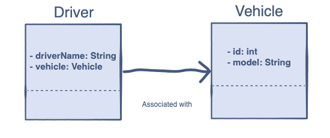

# Java Programming: oop

## Challenge: Associate Vehicle and Its Driver

In this task, you have to perform association between two classes in Java.

### Problem Statement

You have to implement a `Vehicle` class containing members i.e. <b>id</b> and <b>model</b>, and a `Driver` class 
such that there is an association between them.

A `Driver` has a <b>driverName</b> and a `Vehicle` object.

You have to create a `vehicle` with <b>id</b>: `4453`, and <b>model</b>: `Volvo S60`. 
You also then have to create a `Driver` instance with the <b>driverName</b>: <i>John</i>, such that he is assigned 
the above mentioned vehicle.

## Task steps

1. Put your program here: `com.github.akarazhev.jacademy.practice.jprog.task13` in the `Main` class;
2. Write a meaningful message with a commit and push the code;
3. Show the result to a mentor;
4. Answer some questions.

## Quiz

1. In a part-of relationship between two classes:

A) Both classes must be a part of the other.

B) One class must be a part of the other.

C) Both classes should be parts of a third class.

2. What kind of relationship does composition use?

A) Part-of.

B) Has-A.

C) None of the above.

3. What should we call it when an object has its own lifecycle and child object cannot belong to another parent object?

A) Association.

B) Composition.

C) Aggregation.

D) Inheritance.

4. What kind of relationship does association follow?

A) Part-of.

B) Has-a.

C) It’s a generic term used for both of the above.

## Questions

1. What is the `Aggregation`?
2. Propose a couple of examples.
3. What is the `Composition`?
4. Propose a couple of examples.

## Answers

Answer questions to a mentor in English.