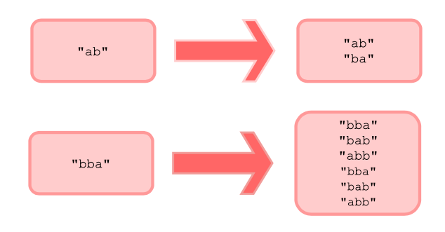

# Java Programming: Recursion

## Challenge: Print all Permutations of a String

In this task, you must implement the code to find and print all permutations of a given string using recursion.

### Problem Statement

For this challenge, you will be given an array and its length, and you must print out all the permutations of the 
<b>array</b>.

A permutation is an arrangement of all or part of a set of objects. For example, the arrangement of words 'cat' and 
'act' represent two distinct permutations (or arrangements) of a similar three letter word.

The illustration below explains the concept.



### Sample Input

`ba`

### Sample Output

`ab`

## Task steps

1. Put your program here: `com.github.akarazhev.jacademy.practice.jprog.task16` in the `Solution` class; 
2. Write a meaningful message with a commit and push the code;
3. Show the result to a mentor.

## Quiz

1. The task is to reverse the string provided.

```java
public static String reverseString(String myStr) {
    // Base case
    if (myStr.isEmpty()) {
        return myStr;
    } else {
        // Recursive case
        return reverseString(myStr.substring(1)) + myStr.charAt(0);
    }
}
```

What should the base case of the above mentioned code be?

A) myStr == null

B) myStr.isEmpty()

C) myStr.length < 1

2. What is the output of the following code?

```java
public static int totalVowels(String text, int len, int index) {
    int count = 0;
    if (len == 0) {
        return 0;
    }
    
    char single = Character.toUpperCase(text.charAt(index));
    if (single == 'A' || single == 'E' || single == 'I' || single == 'O' || single == 'U') {
        count++;
    }
    
    return count + totalVowels(text, len - 1, index + 1);
}

public static void main(String[] args) {
    String text = "thisisrecursion";
    int cnt = 0;
    cnt = recursiveFunc(text, text.length, 0);
    System.out.println(cnt);
}
```

A) 7

B) 10

C) 8

D) 6

## Answers

Answer questions to a mentor in English.

## Theory chapters

1. [What is Recursion?](../../../java-programming/doc/recursion/chapter_1.md "What is Recursion?") - What is Recursion?
2. [Recursion and Memory Visualization](../../../java-programming/doc/recursion/chapter_2.md "Recursion and Memory Visualization") -
   Recursion and Memory Visualization;
3. [Direct vs. Indirect Recursion](../../../java-programming/doc/recursion/chapter_3.md "Direct vs. Indirect Recursion") -
   Direct vs. Indirect Recursion;
4. [When to use Recursion](../../../java-programming/doc/recursion/chapter_4.md "When to use Recursion") - When to use Recursion;
5. [What to Expect](../../../java-programming/doc/recursion/chapter_5.md "What to Expect") - What to Expect;
6. [Understanding a Recursive Problem](../../../java-programming/doc/recursion/chapter_6.md "Understanding a Recursive Problem") -
   Understanding a Recursive Problem;
7. [Advantages and Disadvantages](../../../java-programming/doc/recursion/chapter_7.md "Advantages and Disadvantages") -
   Advantages and Disadvantages;
8. [Introduction](../../../java-programming/doc/recursion/chapter_8.md "Introduction") - Introduction;
9. [Recursion vs. Iteration](../../../java-programming/doc/recursion/chapter_9.md "Recursion vs. Iteration") - Recursion vs. Iteration;
10. [Changing Iterative Code to Recursive](../../../java-programming/doc/recursion/chapter_10.md "Changing Iterative Code to Recursive") -
    Changing Iterative Code to Recursive;
11. [Sum of Integers from 1 to n](../../../java-programming/doc/recursion/chapter_11.md "Sum of Integers from 1 to n") -
    Sum of Integers from 1 to n;
13. [Computing Fibonacci Sequence](../../../java-programming/doc/recursion/chapter_12.md "Computing Fibonacci Sequence") -
    Computing Fibonacci Sequence;
14. [Reversing a String](../../../java-programming/doc/recursion/chapter_13.md "Reversing a String") - Reversing a String;
15. [Removing Duplicates in a String](../../../java-programming/doc/recursion/chapter_14.md "Removing Duplicates in a String") -
    Removing Duplicates in a String.