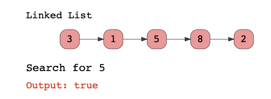

# Java Programming: Recursion

## Challenge: Search for a Value in a Linked List

In this task, you have to implement the code to search for a value in the linked list.

### Problem Statement

When given a linked list, the method should return true if a certain value is present in the list or return false if 
not present in the list.

The following illustration explains this concept.



The method where you must write to write your code is provided and you cannot change the input parameters.

## Task steps

1. Put your program here: `com.github.akarazhev.jacademy.practice.jprog.task18` in the `Solution` class; 
2. Write a meaningful message with a commit and push the code;
3. Show the result to a mentor.

## Quiz

1. Imagine you have a linked list with five nodes. Your task is to traverse the linked list recursively.

```java
public static void printListRecursively (Node head) {
    // base case
    // recursive case
    System.out.print(head.data + " ");
    printListRecursively(head.next);
}
```

What is the base case of the above code?

A) 
```java
if (head == null) {
    return;
}
```

B)
```java
if (head.next == null) {
    return;
}
```

2. Imagine you have a graph with four nodes. The graph has the following edges as follows: { [ 0,1 ], [ 0,2 ] ,[ 1,4 ], 
   [ 1,3 ], [ 2, 4 ] } The function below prints the nodes and vertices connected to each vertex.

```java
public static void connected(int v, Vector<Integer> visited) {
    // base case
    // recursive case
    connected(v + 1, visited);


}
```

What is the base case of the above code?

A)
```java
if ( v==0 ) { return; }
```

B)
```java
if ( v==1 ) { return; }
```

C)
```java
if ( visited[v] == 0 ) { return; }
```

D)
```java
if ( visited[v] == 1 ) { return;}
```

3. See the code for BST implementation below:

```java
public class TreeNode
{
    int value;
    TreeNode left;
    TreeNode right;
    
    public static TreeNode newTreeNode(int data) {
        TreeNode temp = new TreeNode();
        temp.value = data;
        temp.left = null;
        temp.right = null;
        return temp;
    }

    void insert(TreeNode root, int data) {
        if (data < root.value) {
            insert(root.left,data);
        } else {
            insert(root.right, data);
        }
    }
}
```

What is the `base` case for the insert function?

A)
```java
if (root != null) {
    root = newTreeNode(data);
    return;
}
```

B)
```java
if (root == null) {
    root = newTreeNode(data);
    return;
}
```

C)
```java
if (root == null) {
    return;
    root = newTreeNode(data);
}
```

## Answers

Answer questions to a mentor in English.

## Theory chapters

1. [What is Recursion?](../../../java-programming/doc/recursion/chapter_1.md "What is Recursion?") - What is Recursion?
2. [Recursion and Memory Visualization](../../../java-programming/doc/recursion/chapter_2.md "Recursion and Memory Visualization") -
   Recursion and Memory Visualization;
3. [Direct vs. Indirect Recursion](../../../java-programming/doc/recursion/chapter_3.md "Direct vs. Indirect Recursion") -
   Direct vs. Indirect Recursion;
4. [When to use Recursion](../../../java-programming/doc/recursion/chapter_4.md "When to use Recursion") - When to use Recursion;
5. [What to Expect](../../../java-programming/doc/recursion/chapter_5.md "What to Expect") - What to Expect;
6. [Understanding a Recursive Problem](../../../java-programming/doc/recursion/chapter_6.md "Understanding a Recursive Problem") -
   Understanding a Recursive Problem;
7. [Advantages and Disadvantages](../../../java-programming/doc/recursion/chapter_7.md "Advantages and Disadvantages") -
   Advantages and Disadvantages;
8. [Introduction](../../../java-programming/doc/recursion/chapter_8.md "Introduction") - Introduction;
9. [Recursion vs. Iteration](../../../java-programming/doc/recursion/chapter_9.md "Recursion vs. Iteration") - Recursion vs. Iteration;
10. [Changing Iterative Code to Recursive](../../../java-programming/doc/recursion/chapter_10.md "Changing Iterative Code to Recursive") -
    Changing Iterative Code to Recursive;
11. [Sum of Integers from 1 to n](../../../java-programming/doc/recursion/chapter_11.md "Sum of Integers from 1 to n") -
    Sum of Integers from 1 to n;
13. [Computing Fibonacci Sequence](../../../java-programming/doc/recursion/chapter_12.md "Computing Fibonacci Sequence") -
    Computing Fibonacci Sequence;
14. [Reversing a String](../../../java-programming/doc/recursion/chapter_13.md "Reversing a String") - Reversing a String;
15. [Removing Duplicates in a String](../../../java-programming/doc/recursion/chapter_14.md "Removing Duplicates in a String") -
    Removing Duplicates in a String;
16. [Find the First Occurrence of a Number in an Array](../../../java-programming/doc/recursion/chapter_15.md
    "Find the First Occurrence of a Number in an Array") -
    Find the First Occurrence of a Number in an Array;
17. [Invert the Position of Elements in an Array](../../../java-programming/doc/recursion/chapter_16.md "Invert the Position of Elements in an Array") -
    Invert the Position of Elements in an Array;
18. [Print a Reversed Linked List](../../../java-programming/doc/recursion/chapter_17.md "Print a Reversed Linked List") -
    Print a Reversed Linked List.